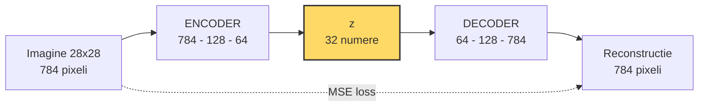
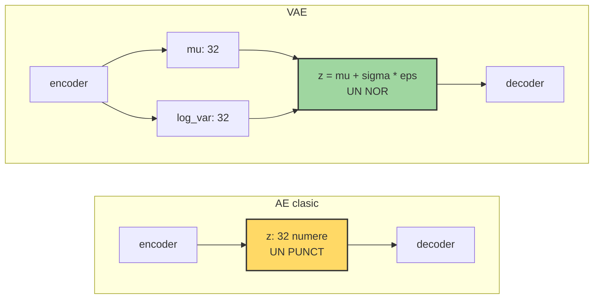
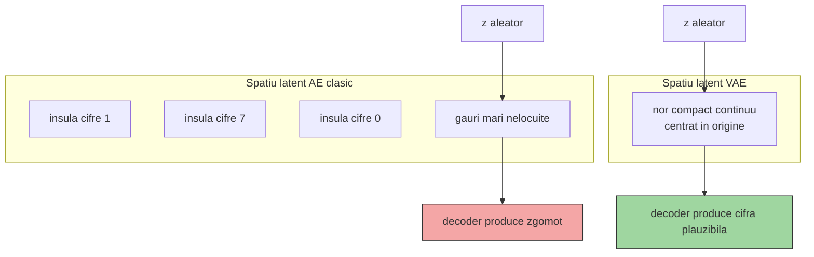
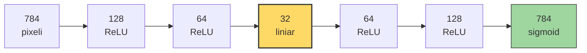

# Autoencoder clasic — flux de date

Imaginea intră ca 784 de pixeli, e strânsă printr-un gât îngust de 32 de numere,
apoi reconstruită tot la 784. Nu există etichete: ținta loss-ului este chiar
imaginea de intrare.



Săgeata punctată este esența: modelul se compară cu propria intrare.
Dacă gâtul `z` ar avea 784 de  
dimensiuni, rețeaua ar putea copia intrarea
pixel cu pixel și nu ar învăța nimic despre structura datelor.

# AE clasic vs. VAE — ce se schimbă în gât

Autoencoderul clasic trimite spre decoder un singur punct. VAE trimite
parametrii unei distribuții și eșantionează din ea, ceea ce face spațiul
latent continuu și deci utilizabil pentru generare.



La VAE, `eps` este zgomot aleator standard-normal. Reparametrizarea
`z = mu + sigma * eps` mută aleatorul în afara drumului gradientului,
astfel încât backpropagation să poată în continuare ajusta `mu` și `log_var`.


# De ce AE clasic nu poate genera

Ambele modele reconstruiesc bine. Diferența apare când eșantionezi un `z`
aleator și îl dai direct decoderului, fără să fi trecut printr-o imagine reală.



Termenul KL din loss-ul VAE este forța care strânge toate codurile spre
origine. Fără el, VAE degenerează într-un autoencoder obișnuit.

```mermaid
784 pixeli  --ReLU-->  128         --ReLU-->  64          --ReLU-->  32
imagine bruta          segmente,              bucle,                 "ce fel
                       capete de linie        intersectii,           de cifra,
                                              colturi                cum scrisa"

            trasaturi              trasaturi               esenta
            simple                 compuse

```
```mermaid
ENCODER:  784 -> 128 -> 64 -> 32
                                  z
DECODER:                     32 -> 64 -> 128 -> 784

```


